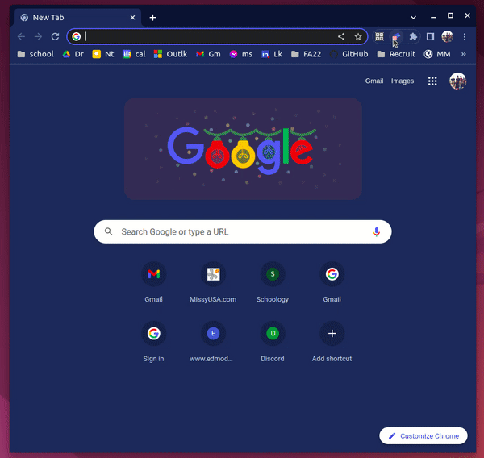

# bookmark-randomizer
Opens a random page from a Chrome bookmark folder.

  

[Install Bookmark Randomizer through Chrome Extension Web Store](https://chrome.google.com/webstore/detail/bookmark-randomizer/foebageigohbbhjajjofdpfgdnmipncf/related?hl=en)
